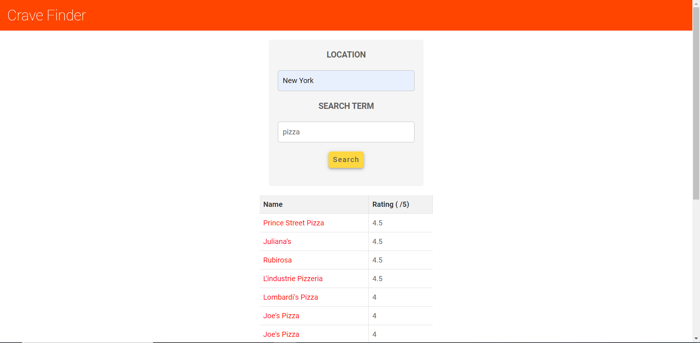
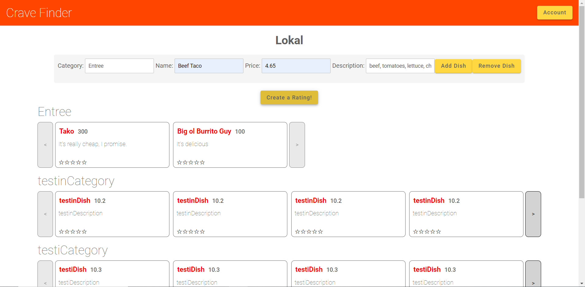
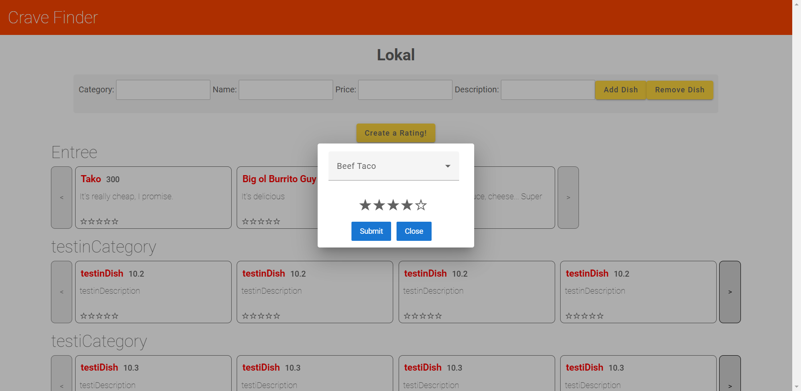
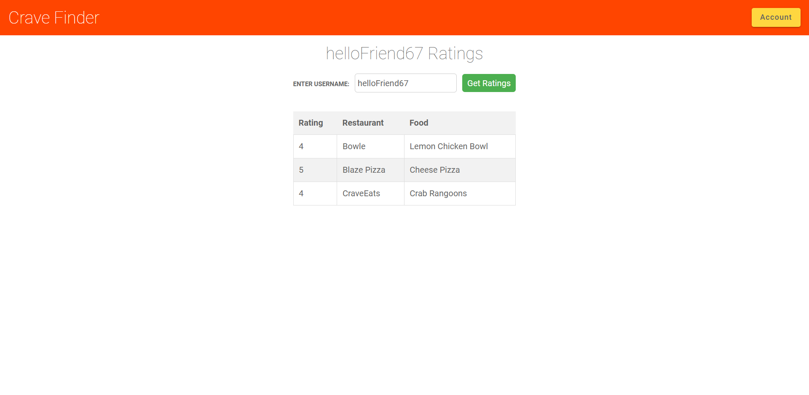
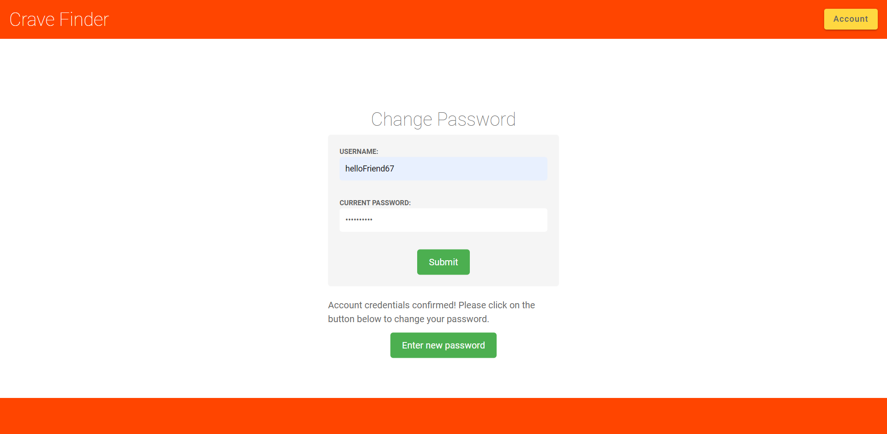

# Project name
Crave Finder

## Project description
**Frontend code (in 'frontend' branch):**
https://github.com/ZacharyBournand/crave-finder/tree/frontend

**Backend code (in 'backend' branch):**
https://github.com/ZacharyBournand/crave-finder/tree/backend


Our web applicaton seeks to make finding new flavors at local restaurants a piece of cake!

On our web app, the user would be able to search for local restaurants that have a particular menu item they're craving. Want to go and get crab rangoons? No problem. Heard of something that sounded good, but don't know what the name of the restaurant is called? No big deal.

Once the user decides on a restaurant, they will be able to view their menu directly from the web app. In addition to this, each restaurant on our app will have a collection of ratings. A restaurant will have ratings for cleanliness, customer service, wait times, an overall rating, and most importantly: a restaurant's menu will have each item rated individually.

User ratings will be stored on their profile allowing other users to compare tastes and possibly explore dishes and restuarants that people with similar tastes have rated highly.

## Main Takeaways:
- Search for restaurants by menu items<br>
<br><br>
- Add & remove food items<br>
<br><br>
- Rate menu items<br>
<br><br>
- View a user's ratings<br>
<br><br>
- Change your password<br>
<br>

## Members
Front-end (Angular/Typescript)
- Jon Dela Cruz
- Renee Kaynor

Back-end (Golang)
- Zachary Bournand
- Dylan Bickram

## How to Run and Use our Application
**How to Run our Application**
1. Go to: https://github.com/ZacharyBournand/crave-finder

2. Clone the repository
    - Click on the green "Code" button 
    - Copy the HTTPS link: https://github.com/ZacharyBournand/crave-finder.git
    - Open "Git Bash" (or another application to clone the repository)
    - Paste the copied HTTPS link
    - Type "code crave-finder" to open the application in Visual Studio Code (or open it in another code editor)
    
3. If you do not have npm, go to https://nodejs.org/en/download
    - Download the version that fits your operating system 
    - Restart Visual Studio Code
    - Open a terminal and type "npm -v" to see if it has been installed
    - Then, go to the "frontend" directory (your path should end with "crave-finder\frontend"). Then, type the command: "npm install -g @angular/cli"

4. Once in a code editor, open a new terminal (the end of your directory should be "\crave-finder")
    - Go to "frontend" (type "cd frontend) [Now your directory should end with "\crave-finder\frontend"]
    - Type the following commands in your terminal:
        ```
        npm install angular
        ng add @ng-bootstrap/ng-bootstrap --force
        ```

5. If you do not have Golang installed, you can download it at https://go.dev/dl/
    - You can then add the Go extension in Visual Studio Code
    - If Go is not available, it will give you the option at the bottom right to get it

6. Open a new terminal (the end of your directory should also be "\crave-finder")
    - Go to "backend" (type "cd backend) [Now your directory should end with "\crave-finder\backend"]
    - Type the following commands in your terminal:
        ```
        go get -u github.com/go-sql-driver/mysql
        go get golang.org/x/crypto/bcrypt
        go get github.com/gorilla/context
        go get github.com/gorilla/sessions
        go get github.com/gorilla/handlers
        ```
            
7. Run the application:
     - In your "\crave-finder\frontend" terminal, type the following command to run the frontend: "ng serve --open"
     - In your "\crave-finder\backend" terminal, type the following command to run the backend: "go run main.go"
     
    
**How to Use our Application**
1. On the Home Page, you can either:
     - Sign Up
     - Log In
     - Search for a Restaurant or Food Item in your chosen City
2. If you Log In, you get access to the "Account" button at the top right corner that gives 3 options:
     - "Reviews": you can look up an individual user's ratings
     - "Change Password": you can change you account's password
     - "Logout": you can log out 
3. If you Search for a Restaurant or Food Item in your chosen City, you can Click on a Restaurant that appeared in your search result
     - Now, you can Add a restaurant's Dish to the Database
     - You can also Remove a restaurant's Dish from the Database
     - And you can Create a Dish Rating that gets stored in the Database
